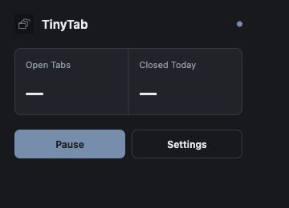

# TinyTab

[中文](README.zh.md)

A tiny, predictable tab janitor for Atlas and modern Chromium browsers.

TinyTab closes tabs that have stayed genuinely idle for 30 minutes. It protects active work, pinned tabs, media, recent page activity, edited forms, and whitelisted domains.

TinyTab 是一个面向 Atlas 与现代 Chromium 浏览器的小型标签页清理器。默认 30 分钟后关闭真正闲置的标签页，同时保护活跃工作、固定标签、媒体播放、近期页面活动、已编辑表单与白名单域名。

<p align="center"></p>

## Install

1. Download or clone this repository.
2. Run `npm ci && npm run build`.
3. Open `chrome://extensions` in Atlas, Chrome, Edge, Brave, or another Chromium browser.
4. Enable Developer mode, choose **Load unpacked**, then select `dist/`.

Chrome Web Store distribution comes after the MVP is field-tested.

## Usage

TinyTab starts with these defaults:

```text
30 minutes          # idle timeout
Smart Close: on     # protect meaningful activity
Skip active: on
Skip pinned: on
```

Open the toolbar popup to pause cleanup or view today's close count. Open Settings to change timeout and whitelist domains.

Whitelist examples:

```text
chatgpt.com
claude.ai
*.github.com
localhost
127.0.0.1
```

## How it works

```text
alarm → scan tabs → evaluate safeguards → recheck live state → close
```

- **One alarm:** scans once per minute; never creates one timer per tab.
- **Deterministic policy:** pure decision logic returns one explicit keep/close reason.
- **Smart Close:** combines Chromium `lastAccessed` with coarse interaction, media, form-edit, and page-activity signals.
- **Private by design:** no analytics, remote requests, page text, form values, request bodies, or browsing-history export.

See [architecture](docs/architecture.md) and [privacy policy](PRIVACY.md).

## Development

```sh
npm ci
npm run verify
```

Requires Node.js 20.19+.

## Limitations

TinyTab cannot reliably detect every `beforeunload` handler or custom editor state. Closing is intentionally silent and currently has no undo history.

## License

[MIT](LICENSE) · Built by [Bubu](https://github.com/MisterBrookT).
